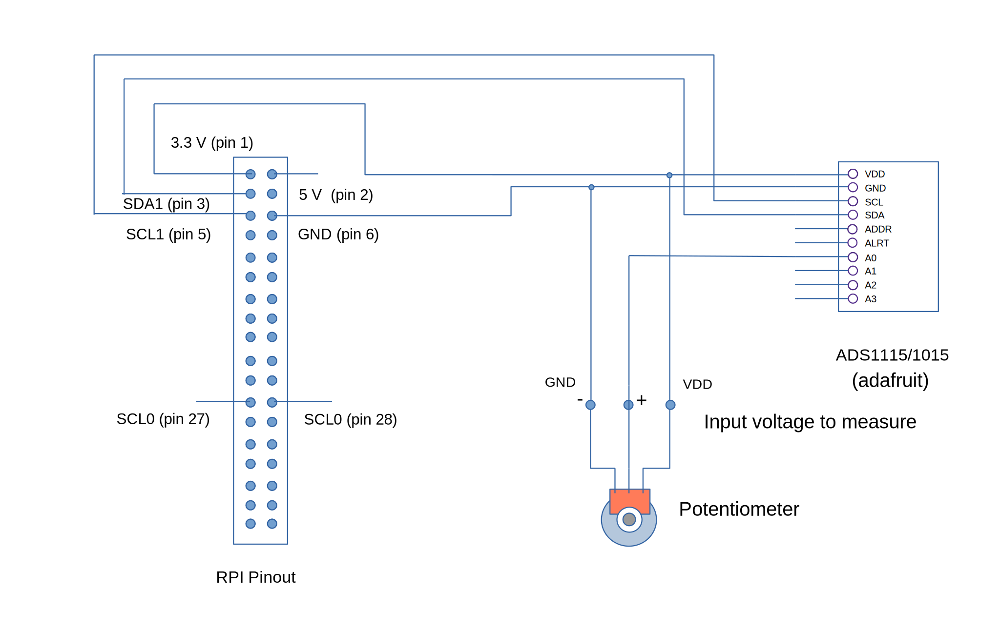

## Raspberry Pi communication with ADS1115/1015 ADC 16/12 BIT I2C using array-gpio library

In this example, we will measure the Raspberry Pi 5V supply voltage using ADC1115/1015 ADC I2C module. We will use the array-gpio library to communicate with the ADS1115/1015 ADC. We will also use a simple potentiometer to simulate different voltage level for measurement. 



## Setup

### 1. Create a project directory and install array-gpio.
```js
$ npm install array-gpio
```
### 2. Save the code below as app.js in your project directory.
```js
const r = require('array-gpio');

let i2c = r.startI2C(1);    // using SDA1 and SCL1 pins (pin 3 & 5)

/* led conversion indicator (optional) */
let led = r.out(33); 

/* set data transfer speed to 200 kHz */
i2c.setTransferSpeed(200000);

/* using the default address */
i2c.selectSlave(0x48);

/* setup write and read data buffer */
const wbuf = Buffer.alloc(16); // write buffer
const rbuf = Buffer.alloc(16); // read buffer

/* access config register */
wbuf[0] = 1; // config register address 

/* MSB data to be written to config register */
wbuf[1] = 0b11000010;   // continous conversion using A0 input
//wbuf[1] = 0b11000011;	// single shot conversion using A0 input
  // bit 15 flag bit for single shot
  // Bits 14-12 input selection:
  // 100 ANC0; 101 ANC1; 110 ANC2; 111 ANC3
  // Bits 11-9 Amp gain. Default to 010 here 001 P19
  // Bit 8 Operational mode of the ADS1115.
  // 0 : Continuous conversion mode
  // 1 : Power-down single-shot mode (default)

/* using A1 input */
//wbuf[1] = 0b11010011; // single shot conversion using A1 input 
//wbuf[1] = 0b11010010;	// continous conversion using A1 input

/* LSB data to be written to config register */
wbuf[2] = 0b10000101;
  // Bits 7-5 data rate default to 100 for 128SPS
  // Bits 4-0  comparator functions see spec sheet.

/* write the MSB and LSB values to the config register */
i2c.write(wbuf, 3); 

/* access the conversion register  */
wbuf[0] = 0; // conversion register address
i2c.write(wbuf, 1);

// volts per step
const vps = 4.096 / 32768.0;

// voltage data source
let vds = exports.vds = function(){

	i2c.read(rbuf, 3);

	let data0 = rbuf[0]; 
	let data1 = rbuf[1];
	let data2 = rbuf[2];

  let v = data0 << 8 | data1;
	
	if(v < 0){
		v = 0;	
	}
  
  /* pulse the led to indicate the conversion process (optional) */
  led.pulse(500);    

	let val = v * vps;
	let value = val.toFixed(2); // result should be rounded to 2 decimal places e.g 2.34, 1.48 V

	return val;
}

console.log('voltage value', vds());

```
### 3. Start your application.
```js
$ node app.js
```

### 4. The expected output should be 0 to 4 V.
```js
$ voltage value 2.43 
```


